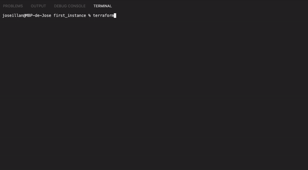

# Terraform-Basics
This project was created using [Terraform](https://github.com/hashicorp/terraform) version v1.2.9.

## Useful terraform commands
    > terraform init
To initiate a terraform project in the current folder

    > terraform validate
To validate the syntax inside the current terraform project/module.

    > terraform plan
To see a simulation of how this infrastrcture would be created. It´s useful to check the variable propagation and dependencies.

    > terraform apply -auto-approve
Apply/Deploy the infrastructure described in the terraform. `-auto-aprove` flag skips the interactive actions before applying.

    > terraform destroy -auto-approve
Destroy the infrastructure described in the terraform. `-auto-aprove` flag skips the interactive actions before destroying

## Complete CLI documentation
[Terraform CLI Documentation](https://www.terraform.io/cli)

## References

This repository contains the exercises of Udemy course (https://www.udemy.com/course/aprende-terraform-con-aws-desde-cero-2021-v10-compatible/) By Alvaro Gomez Folgado (https://www.linkedin.com/in/alvaro-gomez-folgado-b7842770/?originalSubdomain=es)
